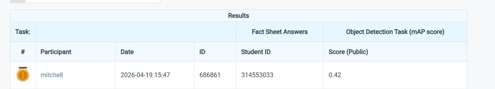

# NYCU Computer Vision 2026 HW2

- **Student ID:** 314553033
- **Name:** 蘇承泰

## Introduction
This repository contains the implementation for NYCU Computer Vision 2026 Homework 2: Digit Detection. The objective of this project is to accurately localize and classify numerical digits in complex and crowded scenes.

Our solution is built upon the **RT-DETR (Real-Time DEtection TRansformer)** architecture utilizing a **ResNet-50-VD** backbone. To further enhance the model's ability to focus on small digit instances and suppress background noise, we innovatively integrated the **Convolutional Block Attention Module (CBAM)** into the Hybrid Encoder's multi-scale feature fusion layers (FPN and PAN). 

### Key Features
- **CBAM Integration:** Enhanced feature representation through sequential channel and spatial attention mechanisms during cross-scale fusion.
- **Optimized Training Strategy:** Employed a Cosine Annealing learning rate scheduler to ensure stable convergence in the final epochs.
- **Custom Inference & Visualization:** The provided `generate_submission.py` script not only outputs the perfectly calibrated `pred.json` (COCO format) but also automatically generates high-quality PDF/PNG training curves and qualitative bounding-box visualizations for easy analysis.

## Environment Setup
Follow the steps below to set up the Conda environment and install the required dependencies:

```bash
conda create -n rtdetr python=3.10 -y
conda activate rtdetr
pip install torch torchvision torchaudio --index-url https://download.pytorch.org/whl/cu118
pip install -r requirements.txt
```
## Usage
### Directory Structure
Before running the code, please ensure your dataset and scripts are organized as follows:
``` Planetext
.
├── dataset/
│   └── nycu-hw2-data/
│       ├── train/
│       ├── valid/
│       └── test/
├── configs/
├── src/
└── tools/
```
### Training
Run the following command to start training:
``` bash
export CUDA_VISIBLE_DEVICES=0
python tools/train.py -c configs/rtdetr/rtdetr_r50vd_6x_hw2.yml
```
### Inference
Run the following command to generate the submission file and visualizations:
``` bash
python tools/infer.py \
  -c configs/rtdetr/rtdetr_r50vd_6x_hw2.yml \
  -r ./output/0417_rtdetr_r50vd_6x_hw2/checkpoint0049.pth \
  -t ./dataset/nycu-hw2-data/test/ \
  -o output/0417_rtdetr_r50vd_6x_hw2/results/pred.json
```
## Performance Snapshot

